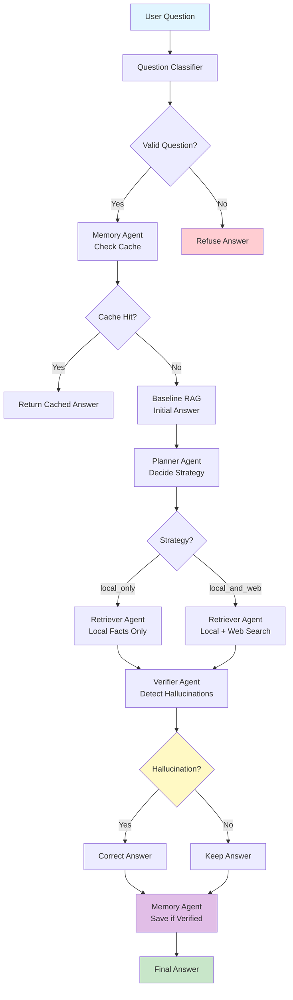
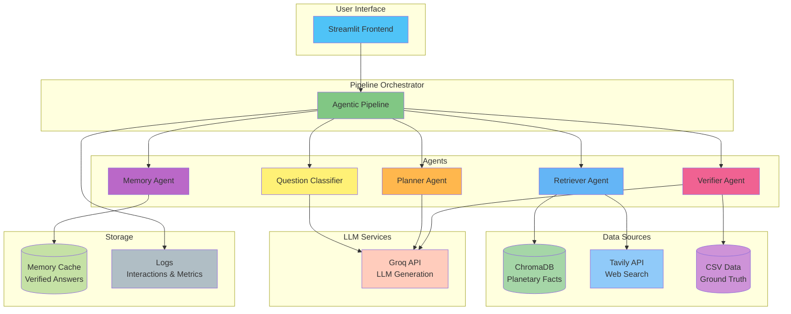
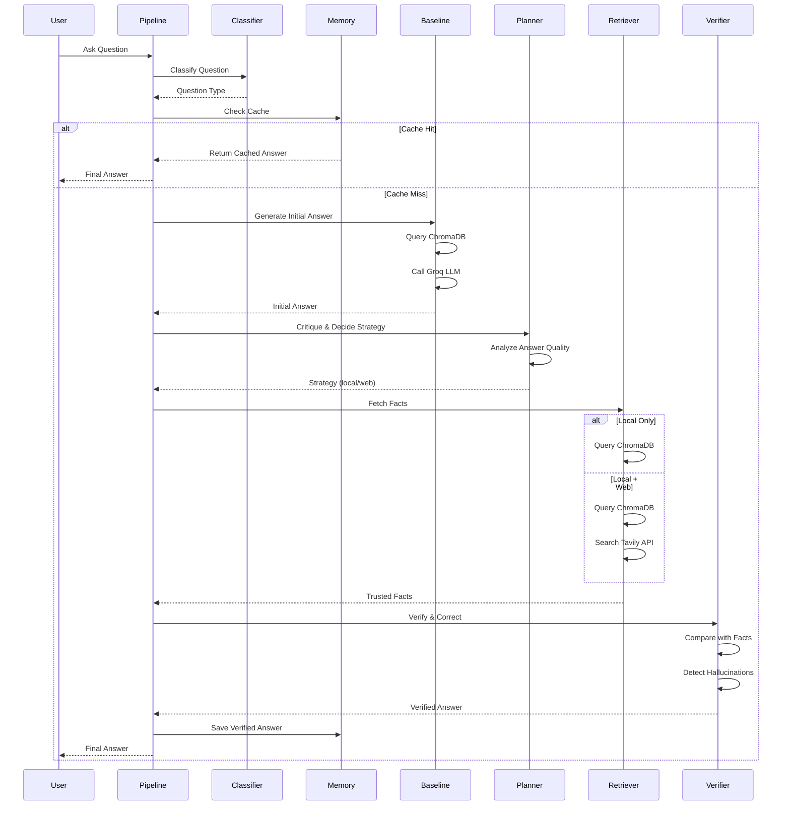

# 🚀 Agentic RAG-Based AI System - Complete Project Documentation

## 📋 Table of Contents

1. [Project Overview](#project-overview)
2. [System Architecture](#system-architecture)
3. [Core Components](#core-components)
4. [Data Flow & Pipeline](#data-flow--pipeline)
5. [Step-by-Step Process](#step-by-step-process)
6. [Technical Implementation Details](#technical-implementation-details)
7. [Setup & Installation](#setup--installation)
8. [Usage Guide](#usage-guide)
9. [Evaluation & Metrics](#evaluation--metrics)
10. [Key Features](#key-features)
11. [Project Structure](#project-structure)

---

## Project Overview

This is a **full-stack multi-agent RAG (Retrieval-Augmented Generation) system** designed for planetary science Q&A with advanced self-correction capabilities. The system uses multiple specialized AI agents working together to provide accurate, verified answers while detecting and correcting hallucinations.

### Key Objectives

- **Accurate Information Retrieval**: Retrieve relevant planetary facts from local knowledge base (CSV/ChromaDB) and web sources
- **Hallucination Detection**: Automatically detect when the LLM generates incorrect or unsupported information
- **Self-Correction**: Automatically correct answers using trusted facts when hallucinations are detected
- **Memory System**: Cache verified answers to improve response time and consistency
- **Multi-Agent Orchestration**: Coordinate multiple specialized agents (Planner, Retriever, Verifier, Memory) to handle complex queries

### Use Case

The system is specifically designed for answering questions about planetary science, using NASA planetary data as the primary knowledge source. It can handle:
- **Factual Questions**: "How many moons does Mars have?", "What is the surface pressure on Venus?"
- **Nonsense Detection**: Correctly refuses to answer questions like "What is the population of Jupiter?" or "What is the GDP of Saturn?"

---

## System Architecture

### High-Level Architecture Flow



### System Components Diagram



### Agent Interaction Flow



### Technology Stack

- **LLM Backend**: Groq API (llama-3.1-8b-instant)
- **Vector Database**: ChromaDB (persistent on disk)
- **Embeddings**: sentence-transformers/all-MiniLM-L6-v2
- **Web Search**: Tavily API
- **Frontend**: Streamlit
- **Data Source**: NASA planetary facts CSV (`planets_full_clean.csv`)
- **Language**: Python 3.x

---

## Core Components

### 1. **Question Classifier** (`backend/classifier.py`)

**Purpose**: Classifies incoming questions to determine if they are valid planetary science questions or nonsense/out-of-scope queries.

**Functionality**:
- Extracts planet names from questions
- Detects nonsense keywords (visa, population, GDP, etc.)
- Uses LLM for ambiguous cases to distinguish physical/astronomical properties from social/legal concepts
- Returns classification: `planet_fact` or `nonsense_or_out_of_scope`

**Output**:
```python
QuestionClassification(
    question_type: str,  # "planet_fact" or "nonsense_or_out_of_scope"
    is_answerable_from_local: bool,
    detected_planet: str | None
)
```

### 2. **Memory Agent** (`backend/agents/memory_agent.py`)

**Purpose**: Caches verified answers to avoid redundant processing and improve response time.

**Functionality**:
- Searches ChromaDB `corrections_memory` collection for similar questions
- Uses semantic similarity (embeddings) to find cached answers
- Only returns cached answers that were NOT hallucinations
- Saves new verified answers with metadata (trusted facts, sources, timestamp)

**Key Methods**:
- `search(question, n_results=2)`: Finds similar cached questions
- `save(...)`: Stores verified answers with full context

**Storage**: ChromaDB collection `corrections_memory` with embeddings of questions

### 3. **Baseline RAG** (`backend/baseline_rag.py`)

**Purpose**: Provides initial answer using simple RAG pipeline (retrieval + LLM generation).

**Functionality**:
- Retrieves top-k relevant documents from ChromaDB using semantic search
- Builds prompt with retrieved context
- Generates answer using Groq LLM
- Returns answer with source documents and metadata

**Process**:
1. Query ChromaDB `planets_facts` collection with question embedding
2. Retrieve top 4 most similar documents
3. Format context from retrieved documents
4. Call Groq LLM with context + question
5. Return answer and source documents

### 4. **Planner Agent** (`backend/agents/planner_agent.py`)

**Purpose**: Self-critiques the baseline answer and decides retrieval strategy.

**Functionality**:
- Analyzes baseline answer quality and completeness
- Determines if additional web search is needed
- Returns routing decision: `local_only` or `local_and_web`

**Decision Logic**:
- **`local_only`**: Baseline answer is reliable, local facts are sufficient
- **`local_and_web`**: Baseline lacks certainty, needs external confirmation, or references missing data

**Output**:
```python
PlannerDecision(
    confidence: float,  # 0.0 to 1.0
    strategy: "local_only" | "local_and_web",
    critique: str  # Explanation of decision
)
```

### 5. **Retriever Agent** (`backend/agents/retriever_agent.py`)

**Purpose**: Fetches trusted facts from local knowledge base and optionally from web search.

**Functionality**:
- **Local Retrieval**: Queries ChromaDB for relevant planetary facts
- **Web Search** (if enabled): Uses Tavily API to search the web
- **Result Filtering**: Filters web results to ensure relevance:
  - Must mention target planet (if detected)
  - Must contain space/astronomy context terms
  - Must NOT contain disallowed terms (location, finance terms)

**Output**:
```python
RetrieverOutput(
    local_results: RetrievalChunk,  # Documents, metadatas, ids from ChromaDB
    web_results: List[Dict],  # Raw Tavily search results
    web_snippets: List[str],  # Formatted web content
    used_web: bool
)
```

### 6. **Verifier Agent** (`backend/agents/verifier_agent.py`)

**Purpose**: Validates baseline answers against trusted facts and corrects hallucinations.

**Functionality**:
- Compares baseline answer with retrieved trusted facts
- Detects numeric inconsistencies
- Checks for question-answer misalignment
- Detects location/finance terms in planetary questions (hallucination indicators)
- Regenerates corrected answer using only trusted facts if hallucination detected

**Hallucination Detection Methods**:
1. **Numeric Consistency Check**: Extracts numbers from answer and facts, checks if they match
2. **Topic Alignment**: Ensures answer addresses the question topic
3. **Keyword Detection**: Flags location/finance terms in planetary context
4. **LLM Verification**: Uses LLM to compare answer with facts

**Output**:
```python
VerificationResult(
    final_answer: str,  # Corrected answer (or original if no hallucination)
    hallucination_detected: bool,
    confidence: float,  # 0.0 to 1.0
    notes: str,  # Explanation of verification
    trusted_facts: Dict  # Facts used for verification
)
```

### 7. **Hallucination Detection Module** (`backend/hallucination_detection.py`)

**Purpose**: Comprehensive hallucination detection by comparing answers with ground truth data.

**Functionality**:
- **For Planet Facts**: Extracts structured facts from answer, compares with CSV ground truth
- **For Nonsense Questions**: Evaluates if system correctly refuses to answer
- **Field Matching**: Checks numeric fields (moons, temperature, pressure, etc.) for accuracy
- **Refusal Evaluation**: Determines if system properly refuses nonsense questions

**Detection Process**:
1. Extract facts from answer using `fact_extraction.py`
2. Lookup ground truth from CSV using `facts_lookup.py`
3. Compare extracted vs. ground truth values
4. Calculate confidence based on match rate
5. Return mismatches and hallucination status

**Output**:
```python
{
    "hallucination_detected": bool,
    "mismatches": [
        {"field": str, "answer_value": Any, "true_value": Any}
    ],
    "is_correct": bool,
    "refusal_expected": bool,  # For nonsense questions
    "refusal_correct": bool
}
```

### 8. **Pipeline Orchestrator** (`backend/pipeline.py`)

**Purpose**: Coordinates all agents and manages the end-to-end flow.

**Class**: `AgenticPipeline`

**Main Method**: `run(question: str) -> PipelineResult`

**Process**:
1. Check memory cache first
2. If not cached, run baseline RAG
3. Planner decides retrieval strategy
4. Retriever fetches facts
5. Verifier validates and corrects
6. Memory saves result
7. Return final answer

**Enhanced Method**: `run_with_evaluation(question, mode)`
- Adds question classification
- Enhanced hallucination detection
- Self-evaluation
- Comprehensive logging

---

## Data Flow & Pipeline

### Complete Data Flow Diagram

```
┌─────────────────┐
│  User Question  │
└────────┬────────┘
         │
         ▼
┌─────────────────────────┐
│  Question Classifier    │
│  - Extract planet       │
│  - Detect nonsense      │
│  - Classify type        │
└────────┬────────────────┘
         │
         ▼
┌─────────────────────────┐
│   Memory Agent          │
│   - Search cache        │
│   - Check similarity    │
└────────┬────────────────┘
         │
         ├─→ [Cache Hit] → Return Cached Answer
         │
         ▼ [Cache Miss]
┌─────────────────────────┐
│   Baseline RAG          │
│   - Query ChromaDB      │
│   - Retrieve docs      │
│   - Generate answer     │
└────────┬────────────────┘
         │
         ▼
┌─────────────────────────┐
│   Planner Agent         │
│   - Critique answer     │
│   - Decide strategy     │
└────────┬────────────────┘
         │
         ├─→ "local_only"
         │
         └─→ "local_and_web"
         │
         ▼
┌─────────────────────────┐
│   Retriever Agent       │
│   - Local: ChromaDB     │
│   - Web: Tavily API     │
│   - Filter results      │
└────────┬────────────────┘
         │
         ▼
┌─────────────────────────┐
│   Verifier Agent        │
│   - Compare facts       │
│   - Detect hallucination│
│   - Correct answer      │
└────────┬────────────────┘
         │
         ▼
┌─────────────────────────┐
│   Memory Agent          │
│   - Save if verified    │
│   - Skip if hallucination│
└────────┬────────────────┘
         │
         ▼
┌─────────────────────────┐
│   Final Answer          │
│   + Metadata            │
└─────────────────────────┘
```

### Data Sources

1. **Local Knowledge Base**:
   - **Source**: `data/planets_full_clean.csv` (NASA planetary data)
   - **Storage**: ChromaDB `planets_facts` collection
   - **Format**: Pivoted CSV with one record per planet
   - **Embeddings**: sentence-transformers/all-MiniLM-L6-v2

2. **Web Search**:
   - **API**: Tavily Search API
   - **Usage**: Only when Planner decides `local_and_web` strategy
   - **Filtering**: Results filtered for relevance and space context

3. **Memory Cache**:
   - **Storage**: ChromaDB `corrections_memory` collection
   - **Content**: Previously verified Q&A pairs
   - **Metadata**: Trusted facts, sources, hallucination status

---

## Step-by-Step Process

### Example: "How many moons does Mars have?"

#### Step 1: Question Classification
- **Input**: "How many moons does Mars have?"
- **Process**: 
  - Extracts planet: "Mars"
  - No nonsense keywords detected
  - LLM confirms it's a physical/astronomical question
- **Output**: `QuestionClassification(question_type="planet_fact", detected_planet="Mars")`

#### Step 2: Memory Check
- **Process**: Searches `corrections_memory` collection for similar questions
- **Result**: No cache hit (first time asking)
- **Action**: Proceed to baseline RAG

#### Step 3: Baseline RAG
- **Process**:
  1. Embed question: `embed_texts(["How many moons does Mars have?"])`
  2. Query ChromaDB: `collection.query(query_embeddings=[embedding], n_results=4)`
  3. Retrieve documents about Mars (moons, orbital properties, etc.)
  4. Build prompt with context
  5. Call Groq LLM: `call_groq_chat(messages)`
- **Output**: 
  ```python
  {
    "answer": "Mars has 2 moons: Phobos and Deimos.",
    "documents": [...],
    "metadatas": [{"planet": "Mars", "number_of_moons": "2", ...}]
  }
  ```

#### Step 4: Planner Decision
- **Input**: Baseline answer + context excerpt
- **Process**: LLM critiques baseline answer
- **Output**: 
  ```python
  PlannerDecision(
    strategy="local_only",  # Local facts are sufficient
    confidence=0.9,
    critique="Baseline answer is accurate and well-supported by local data."
  )
  ```

#### Step 5: Retrieval
- **Process**:
  - Query ChromaDB for Mars facts (4 documents)
  - Skip web search (strategy is `local_only`)
- **Output**:
  ```python
  RetrieverOutput(
    local_results=RetrievalChunk(
      documents=["Planet record — planet: Mars, number_of_moons: 2, ..."],
      metadatas=[{"planet": "Mars", "number_of_moons": "2", ...}]
    ),
    web_results=[],
    used_web=False
  )
  ```

#### Step 6: Verification
- **Process**:
  1. Compare baseline answer with retrieved facts
  2. Extract number from answer: `2`
  3. Extract number from facts: `2`
  4. Numeric consistency check: ✅ Match
  5. Topic alignment: ✅ Answer addresses question
  6. No location/finance terms detected
- **Output**:
  ```python
  VerificationResult(
    final_answer="Mars has 2 moons: Phobos and Deimos.",
    hallucination_detected=False,
    confidence=0.95,
    notes="Answer is consistent with trusted facts.",
    trusted_facts={...}
  )
  ```

#### Step 7: Memory Save
- **Process**: Save verified answer to `corrections_memory` collection
- **Metadata**:
  ```python
  {
    "question": "How many moons does Mars have?",
    "answer": "Mars has 2 moons: Phobos and Deimos.",
    "hallucination_detected": False,
    "trusted_facts": {...},
    "sources": ["Mars"],
    "timestamp": 1234567890.0
  }
  ```

#### Step 8: Return Result
- **Final Answer**: "Mars has 2 moons: Phobos and Deimos."
- **Status**: ✅ Verified, no hallucination detected
- **Confidence**: 0.95

### Example: Hallucination Detection

#### Question: "What is the population of Jupiter?"

#### Step 1-3: Classification, Memory, Baseline
- Classification: `nonsense_or_out_of_scope` (contains "population")
- Baseline might generate: "Jupiter has a population of approximately 0 as it is a gas giant planet."

#### Step 4-5: Planner, Retrieval
- Planner: `local_and_web` (uncertain about baseline)
- Retrieval: Local facts + web search (no population data found)

#### Step 6: Verification
- **Hallucination Detection**:
  - Question asks for "population" (nonsense for planets)
  - Answer should refuse, not provide a number
  - System detects: Answer doesn't properly refuse
- **Output**:
  ```python
  VerificationResult(
    final_answer="I cannot answer that question. Jupiter is a gas giant planet and does not have a population in the way that Earth does.",
    hallucination_detected=True,
    confidence=0.3,
    notes="Answer does not address question topic 'population'. | Location term detected for planetary question."
  )
  ```

#### Step 7: Memory
- **Not Saved**: Answer was a hallucination, so not cached

---

## Technical Implementation Details

### Embeddings

**Model**: `sentence-transformers/all-MiniLM-L6-v2`
- **Dimensions**: 384
- **Usage**: 
  - Embedding questions for semantic search
  - Embedding documents for storage
  - Embedding cached questions for memory lookup

**Implementation**: `backend/embeddings.py`
```python
def embed_texts(texts: List[str]) -> List[List[float]]:
    model = SentenceTransformer(EMBED_MODEL_NAME)
    return model.encode(texts).tolist()
```

### ChromaDB Setup

**Collections**:
1. **`planets_facts`**: Planetary data from CSV
   - Documents: Natural language descriptions of planet properties
   - Metadata: Full CSV row data (planet name, all attributes)
   - Embeddings: 384-dimensional vectors

2. **`corrections_memory`**: Cached verified answers
   - Documents: Question + Answer + Facts
   - Metadata: Question, answer, trusted facts, sources, timestamp, hallucination status
   - Embeddings: Question embeddings for similarity search

**Initialization**: `backend/chroma_setup.py`
- Loads CSV, pivots to one row per planet
- Formats documents as natural language
- Embeds and upserts to ChromaDB
- Creates collections if they don't exist

### LLM Integration

**Provider**: Groq API
- **Model**: `llama-3.1-8b-instant`
- **Endpoint**: `https://api.groq.com/openai/v1/chat/completions`
- **Usage**: 
  - Baseline answer generation
  - Planner critique
  - Verifier validation
  - Question classification
  - Self-evaluation

**Implementation**: `backend/llm.py`
```python
def call_groq_chat(
    messages: List[Dict[str, str]],
    temperature: float = 0.7,
    api_key: Optional[str] = None,
    model: Optional[str] = None
) -> str:
    # Makes HTTP request to Groq API
    # Returns generated text
```

### Web Search Integration

**Provider**: Tavily API
- **Endpoint**: `https://api.tavily.com/search`
- **Max Results**: 5
- **Filtering**: 
  - Must mention target planet
  - Must contain space/astronomy terms
  - Must NOT contain location/finance terms

**Implementation**: `backend/websearch.py`
```python
def tavily_search(query: str) -> List[Dict[str, Any]]:
    # Makes HTTP request to Tavily
    # Returns search results
```

### Fact Extraction & Ground Truth

**Fact Extraction** (`backend/fact_extraction.py`):
- Extracts structured facts from natural language answers
- Fields: `number_of_moons`, `surface_pressure_bars`, `mean_temperature_celsius`, etc.
- Uses regex and LLM for extraction

**Ground Truth Lookup** (`backend/facts_lookup.py`):
- Loads CSV data
- Returns structured facts for a given planet
- Used for hallucination detection comparison

### Logging System

**Files**:
- `logs/interactions.jsonl`: One JSON object per interaction (append-only)
- `logs/summary_metrics.json`: Aggregated metrics (overwritten)

**Log Schema**:
```json
{
  "question": str,
  "initial_answer": str,
  "final_answer": str,
  "mode": "plain_llm" | "basic_rag" | "agentic_rag",
  "question_type": "planet_fact" | "nonsense_or_out_of_scope",
  "is_answerable_from_local": bool,
  "hallucination_detected": bool,
  "is_correct": bool,
  "refusal_expected": bool,
  "refusal_correct": bool,
  "mismatches": [...],
  "self_eval_confidence": float,
  "trusted_facts": {...},
  "sources_used": [...],
  "timestamp": float
}
```

---

## Setup & Installation

### Prerequisites

- Python 3.8+
- pip package manager
- API Keys:
  - Groq API Key (for LLM)
  - Tavily API Key (for web search, optional)

### Installation Steps

1. **Clone/Navigate to Project**:
   ```bash
   cd project
   ```

2. **Install Dependencies**:
   ```bash
   pip install -r requirements.txt
   ```

3. **Set Up API Keys**:
   
   Edit `backend/config.py` or set environment variables:
   ```bash
   export GROQ_API_KEY="your-groq-api-key"
   export TAVILY_API_KEY="your-tavily-api-key"
   ```

4. **Initialize ChromaDB**:
   
   The system will automatically embed the CSV on first run. To manually initialize:
   ```python
   from backend.chroma_setup import (
       load_planet_dataframe,
       init_chroma_client,
       embed_and_upsert_planets,
       ensure_corrections_collection
   )
   
   df = load_planet_dataframe()
   client = init_chroma_client()
   embed_and_upsert_planets(client, df)
   ensure_corrections_collection(client)
   ```

5. **Verify Setup**:
   ```bash
   python -c "from backend.pipeline import AgenticPipeline; p = AgenticPipeline(); print('Setup complete!')"
   ```

---

## Usage Guide

### Streamlit Frontend

**Start the Application**:
```bash
streamlit run frontend/streamlit_app.py
```

**Features**:
- **Three Modes**:
  - **Agentic RAG**: Full multi-agent pipeline with verification
  - **Baseline RAG**: Simple RAG without agents
  - **Plain LLM**: Direct LLM response (no retrieval)

- **Interactive UI**:
  - Question input
  - Real-time processing
  - Detailed pipeline visualization
  - Retrieved documents display
  - Hallucination detection results
  - Performance metrics

### Command Line Interface

**Evaluate System**:
```bash
python evaluate_system.py -q "How many moons does Mars have?" -q "What is the surface pressure on Venus?"
```

**Run Baseline RAG**:
```bash
python -m backend.baseline_rag
```

**Reset Memory**:
```bash
python reset_memory.py
```

### Programmatic Usage

**Basic Usage**:
```python
from backend.pipeline import AgenticPipeline

pipeline = AgenticPipeline()
result = pipeline.run_with_evaluation("How many moons does Mars have?", mode="agentic_rag")

print(f"Answer: {result.final_answer}")
print(f"Hallucination: {result.verification.hallucination_detected}")
print(f"Confidence: {result.verification.confidence}")
```

**Access Pipeline Components**:
```python
# Individual agents
from backend.agents.planner_agent import PlannerAgent
from backend.agents.retriever_agent import RetrieverAgent
from backend.agents.verifier_agent import VerifierAgent
from backend.agents.memory_agent import MemoryAgent

planner = PlannerAgent()
retriever = RetrieverAgent()
verifier = VerifierAgent()
memory = MemoryAgent()
```

---

## Evaluation & Metrics

### Evaluation Metrics

The system tracks several metrics:

1. **Accuracy**: Percentage of correct answers (no hallucinations)
2. **Hallucination Rate**: Percentage of answers with detected hallucinations
3. **Refusal Accuracy**: For nonsense questions, percentage correctly refused
4. **Overclaim Rate**: For nonsense questions, percentage that incorrectly provided answers
5. **Average Confidence**: Mean confidence score across all answers

### Evaluation Scripts

**`evaluate_system.py`**:
- Runs questions through the pipeline
- Prints results and summary metrics
- Saves metrics to `logs/summary_metrics.json`

**`evaluation/run_batch_eval.py`**:
- Batch evaluation with test questions
- Compares different modes (plain_llm, basic_rag, agentic_rag)
- Generates detailed metrics

### Metrics Format

```json
{
  "plain_llm": {
    "planet_fact": {
      "accuracy": 0.75,
      "hallucination_rate": 0.25,
      "total": 20
    },
    "nonsense_or_out_of_scope": {
      "refusal_accuracy": 0.60,
      "overclaim_rate": 0.40,
      "total": 10
    }
  },
  "basic_rag": {...},
  "agentic_rag": {...}
}
```

### Test Questions

**Valid Questions**:
- "How many moons does Mars have?"
- "What is the surface pressure on Venus?"
- "Does Jupiter have rings?"
- "How many moons does Haumea have?"

**Hallucination Tests**:
- "What is the population of Jupiter?" (should refuse)
- "What is the GDP of Saturn?" (should refuse)
- "List the forests on Neptune." (should refuse)

---

## Key Features

### 1. Multi-Agent Architecture

Four specialized agents work together:
- **Planner**: Decides retrieval strategy
- **Retriever**: Fetches facts from multiple sources
- **Verifier**: Detects and corrects hallucinations
- **Memory**: Caches verified answers

### 2. Hallucination Detection

Multiple detection methods:
- **Numeric Consistency**: Compares numbers in answer vs. facts
- **Topic Alignment**: Ensures answer addresses question
- **Keyword Detection**: Flags inappropriate terms
- **Ground Truth Comparison**: Compares with CSV data

### 3. Self-Correction

When hallucinations are detected:
- System regenerates answer using only trusted facts
- Provides explanation of correction
- Does not cache hallucinated answers

### 4. Memory System

- Semantic search for similar questions
- Only caches verified (non-hallucinated) answers
- Improves response time for repeated questions
- Maintains full context (facts, sources, metadata)

### 5. Question Classification

- Distinguishes valid planetary questions from nonsense
- Handles out-of-scope questions gracefully
- Evaluates refusal behavior

### 6. Multi-Source Retrieval

- **Local**: ChromaDB with NASA planetary data
- **Web**: Tavily API for additional context
- **Filtering**: Ensures web results are relevant and space-related

### 7. Comprehensive Logging

- All interactions logged with full metadata
- Metrics aggregated for analysis
- Supports evaluation and debugging

---

## Project Structure

```
project/
├── backend/
│   ├── agents/                    # Multi-agent system
│   │   ├── planner_agent.py       # Decides retrieval strategy
│   │   ├── retriever_agent.py    # Fetches facts (local + web)
│   │   ├── verifier_agent.py     # Detects hallucinations, corrects
│   │   └── memory_agent.py       # Caches verified answers
│   ├── baseline_rag.py           # Simple RAG baseline
│   ├── pipeline.py               # Main orchestration
│   ├── chroma_setup.py           # ChromaDB initialization
│   ├── embeddings.py             # SentenceTransformer wrapper
│   ├── llm.py                    # Groq API client
│   ├── retrieval.py              # ChromaDB retrieval helpers
│   ├── websearch.py              # Tavily integration
│   ├── classifier.py             # Question classification
│   ├── hallucination_detection.py # Hallucination detection
│   ├── fact_extraction.py        # Extract facts from answers
│   ├── facts_lookup.py           # Ground truth lookup
│   ├── self_eval.py              # Self-evaluation
│   ├── logger.py                 # Logging system
│   └── config.py                 # Configuration
│
├── frontend/
│   └── streamlit_app.py          # Streamlit UI
│
├── data/
│   └── planets_full_clean.csv    # NASA planetary data
│
├── chroma_store/                 # Persistent ChromaDB data
│   ├── planets_facts/           # Planetary facts collection
│   ├── corrections_memory/      # Cached answers collection
│   └── chroma.sqlite3           # ChromaDB database
│
├── logs/
│   ├── interactions.jsonl       # All interactions (JSONL)
│   └── summary_metrics.json     # Aggregated metrics
│
├── evaluation/
│   ├── evaluate_system.py       # Evaluation CLI
│   ├── run_batch_eval.py        # Batch evaluation
│   └── test_questions.json      # Test question sets
│
├── tests/                        # Test suite
│   ├── test_memory.py
│   ├── test_pipeline.py
│   ├── test_retriever.py
│   └── test_verifier.py
│
├── requirements.txt              # Python dependencies
├── README.md                     # Quick start guide
└── PROJECT_DOCUMENTATION.md      # This file
```

### Key Files Explained

- **`backend/pipeline.py`**: Main entry point, orchestrates all agents
- **`backend/baseline_rag.py`**: Simple RAG for comparison
- **`frontend/streamlit_app.py`**: User interface
- **`backend/chroma_setup.py`**: Initializes vector database
- **`backend/config.py`**: Configuration (API keys, paths, etc.)
- **`evaluate_system.py`**: Evaluation script

---

## Summary

This project demonstrates a sophisticated **multi-agent RAG system** with:

✅ **Self-correction capabilities** through hallucination detection  
✅ **Multi-source retrieval** (local + web)  
✅ **Memory system** for caching verified answers  
✅ **Question classification** for handling edge cases  
✅ **Comprehensive evaluation** and metrics  
✅ **User-friendly interface** via Streamlit  

The system is designed for **planetary science Q&A** but the architecture can be adapted for other domains. The multi-agent approach allows for modular, extensible design where each agent has a specific responsibility, making the system robust and maintainable.

---

## Future Enhancements

Potential improvements:
- Support for more data sources
- Advanced fact extraction and reasoning
- Multi-turn conversation support
- Fine-tuning on domain-specific data
- Integration with additional LLM providers
- Enhanced web search filtering
- Real-time learning from corrections

---

**Documentation Version**: 1.0  
**Last Updated**: 2024  
**Project Type**: Research/Educational - Multi-Agent RAG System

