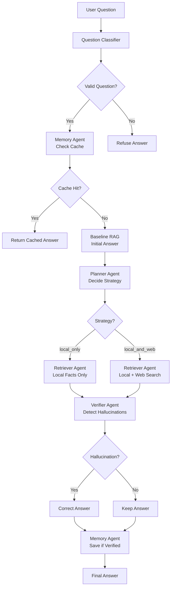

# 🚀 Agentic RAG System with Self-Correction

<div align="center">


**A multi-agent RAG system with advanced hallucination detection and self-correction capabilities for planetary science Q&A**

[Features](#-features) • [Installation](#-installation) • [Usage](#-usage) • [Architecture](#-architecture) • [Documentation](#-documentation)

</div>

---

## 📋 Overview

This project implements a sophisticated **multi-agent Retrieval-Augmented Generation (RAG) system** designed for accurate, verified answers in planetary science. The system uses four specialized AI agents working together to:

- ✅ Retrieve information from multiple sources (local knowledge base + web search)
- ✅ Detect hallucinations through multi-method verification
- ✅ Automatically correct answers using trusted facts
- ✅ Cache verified answers for improved performance
- ✅ Handle edge cases (nonsense questions, out-of-scope queries)

### Key Innovation

Unlike traditional RAG systems, this implementation includes a **self-correction loop** where answers are automatically verified against ground truth data, and hallucinations are detected and corrected before being returned to users.

---

## ✨ Features

### 🤖 Multi-Agent Architecture

- **Question Classifier**: Distinguishes valid questions from nonsense/out-of-scope queries
- **Memory Agent**: Caches verified answers using semantic similarity search
- **Planner Agent**: Self-critiques baseline answers and decides retrieval strategy
- **Retriever Agent**: Fetches facts from ChromaDB and optionally Tavily web search
- **Verifier Agent**: Detects hallucinations and regenerates corrected answers

### 🔍 Hallucination Detection

Multiple detection methods:
- **Numeric Consistency**: Compares numbers in answers vs. ground truth
- **Topic Alignment**: Ensures answers address the question topic
- **Keyword Detection**: Flags inappropriate terms (location/finance in planetary context)
- **Ground Truth Comparison**: Validates against CSV data

### 💾 Memory System

- Semantic search for similar cached questions
- Only stores verified (non-hallucinated) answers
- Improves response time for repeated queries
- Maintains full context (facts, sources, metadata)

### 📊 Comprehensive Evaluation

- Tracks accuracy, hallucination rates, and confidence scores
- Compares three modes: Plain LLM, Baseline RAG, Agentic RAG
- Detailed logging of all interactions

---

## 🏗️ Architecture



For detailed architecture diagrams, see [ARCHITECTURE_DIAGRAMS.md](ARCHITECTURE_DIAGRAMS.md)

---

## 🛠️ Tech Stack

- **LLM**: Groq API (llama-3.1-8b-instant)
- **Vector Database**: ChromaDB (persistent storage)
- **Embeddings**: sentence-transformers/all-MiniLM-L6-v2
- **Web Search**: Tavily API
- **Frontend**: Streamlit
- **Data Source**: NASA planetary facts CSV
- **Language**: Python 3.8+

---

## 📦 Installation

### Prerequisites

- Python 3.8 or higher
- pip package manager
- API Keys:
  - [Groq API Key](https://console.groq.com/) (for LLM)
  - [Tavily API Key](https://tavily.com/) (optional, for web search)

### Step 1: Clone the Repository

```bash
git clone https://github.com/MoizSajjad/Agentic-Rag-System.git
cd Agentic-Rag-System/project
```

### Step 2: Install Dependencies

```bash
pip install -r requirements.txt
```

### Step 3: Configure API Keys

Edit `backend/config.py` or set environment variables:

```bash
export GROQ_API_KEY="your-groq-api-key"
export TAVILY_API_KEY="your-tavily-api-key"
```

### Step 4: Initialize ChromaDB

The system will automatically embed the CSV on first run. To manually initialize:

```python
from backend.chroma_setup import (
    load_planet_dataframe,
    init_chroma_client,
    embed_and_upsert_planets,
    ensure_corrections_collection
)

df = load_planet_dataframe()
client = init_chroma_client()
embed_and_upsert_planets(client, df)
ensure_corrections_collection(client)
```

---

## 🚀 Usage

### Streamlit Frontend (Recommended)

Launch the interactive web interface:

```bash
streamlit run frontend/streamlit_app.py
```

The app provides:
- Three modes: Agentic RAG, Baseline RAG, Plain LLM
- Real-time pipeline visualization
- Retrieved documents display
- Hallucination detection results
- Performance metrics dashboard

### Command Line Interface

Evaluate the system with custom questions:

```bash
python evaluate_system.py -q "How many moons does Mars have?" -q "What is the surface pressure on Venus?"
```

### Programmatic Usage

```python
from backend.pipeline import AgenticPipeline

# Initialize pipeline
pipeline = AgenticPipeline()

# Run with evaluation
result = pipeline.run_with_evaluation(
    "How many moons does Mars have?",
    mode="agentic_rag"
)

# Access results
print(f"Answer: {result.final_answer}")
print(f"Hallucination: {result.verification.hallucination_detected}")
print(f"Confidence: {result.verification.confidence}")
```

---

## 📁 Project Structure

```
project/
├── backend/
│   ├── agents/                    # Multi-agent system
│   │   ├── planner_agent.py      # Decides retrieval strategy
│   │   ├── retriever_agent.py    # Fetches facts (local + web)
│   │   ├── verifier_agent.py     # Detects hallucinations, corrects
│   │   └── memory_agent.py      # Caches verified answers
│   ├── baseline_rag.py           # Simple RAG baseline
│   ├── pipeline.py              # Main orchestration
│   ├── chroma_setup.py          # ChromaDB initialization
│   ├── embeddings.py             # SentenceTransformer wrapper
│   ├── llm.py                    # Groq API client
│   ├── retrieval.py              # ChromaDB retrieval helpers
│   ├── websearch.py              # Tavily integration
│   ├── classifier.py             # Question classification
│   ├── hallucination_detection.py # Hallucination detection
│   ├── fact_extraction.py        # Extract facts from answers
│   ├── facts_lookup.py           # Ground truth lookup
│   ├── self_eval.py              # Self-evaluation
│   ├── logger.py                 # Logging system
│   └── config.py                 # Configuration
├── frontend/
│   └── streamlit_app.py          # Streamlit UI
├── data/
│   └── planets_full_clean.csv   # NASA planetary data
├── chroma_store/                 # Persistent ChromaDB data
├── logs/                         # Interaction logs & metrics
├── evaluation/                   # Evaluation scripts
├── tests/                        # Test suite
├── requirements.txt              # Python dependencies
├── README.md                     # This file
├── PROJECT_DOCUMENTATION.md      # Detailed documentation
└── ARCHITECTURE_DIAGRAMS.md     # Architecture diagrams
```

---

## 🧪 Testing

### Component Tests

```bash
python -m pytest tests/
```

### Scenario Tests

```bash
python reset_memory.py  # Clear cache
python test_scenarios.py
```

### Evaluation

Run comprehensive evaluation:

```bash
python evaluation/run_batch_eval.py
```

---

## 📊 Example Queries

### Valid Questions

- ✅ "How many moons does Mars have?"
- ✅ "What is the surface pressure on Venus?"
- ✅ "Does Jupiter have rings?"
- ✅ "How many moons does Haumea have?"

### Hallucination Tests

- ❌ "What is the population of Jupiter?" (should refuse)
- ❌ "What is the GDP of Saturn?" (should refuse)
- ❌ "List the forests on Neptune." (should refuse)

---

## 📈 Evaluation Metrics

The system tracks:

- **Accuracy**: Percentage of correct answers
- **Hallucination Rate**: Percentage with detected hallucinations
- **Refusal Accuracy**: For nonsense questions, correct refusal rate
- **Average Confidence**: Mean confidence score across answers

Metrics are logged to `logs/summary_metrics.json` and visualized in the Streamlit app.

---

## 📚 Documentation

- **[PROJECT_DOCUMENTATION.md](PROJECT_DOCUMENTATION.md)**: Complete project documentation
- **[ARCHITECTURE_DIAGRAMS.md](ARCHITECTURE_DIAGRAMS.md)**: Detailed architecture diagrams
- **[diagrams.mmd](diagrams.mmd)**: Mermaid diagram source code

---

## 🎯 Use Cases

- **Planetary Science Q&A**: Accurate answers about planets and celestial bodies
- **Fact-Checking**: Hallucination detection and correction
- **Multi-Source Retrieval**: Combining local knowledge base with web search
- **Self-Improving Systems**: Learning from corrections and caching verified answers
- **Research**: Demonstrating multi-agent RAG architectures

---

## 🔧 Configuration

Key configuration options in `backend/config.py`:

- `GROQ_API_KEY`: Your Groq API key
- `GROQ_MODEL_NAME`: Model to use (default: llama-3.1-8b-instant)
- `TAVILY_API_KEY`: Your Tavily API key
- `EMBED_MODEL_NAME`: Embedding model (default: sentence-transformers/all-MiniLM-L6-v2)
- `CHROMA_PERSIST_DIR`: ChromaDB storage directory

---

## 🤝 Contributing

Contributions are welcome! This is a research/educational project demonstrating multi-agent RAG systems with self-correction.

1. Fork the repository
2. Create a feature branch (`git checkout -b feature/amazing-feature`)
3. Commit your changes (`git commit -m 'Add some amazing feature'`)
4. Push to the branch (`git push origin feature/amazing-feature`)
5. Open a Pull Request

---

## 📝 License

This project is licensed under the MIT License - see the [LICENSE](LICENSE) file for details.

---

## 🙏 Acknowledgments

- **NASA** for planetary data
- **Groq** for LLM API
- **Tavily** for web search API
- **ChromaDB** for vector database
- **Streamlit** for frontend framework

---

## 📧 Contact

For questions or suggestions, please open an issue on GitHub.

---
